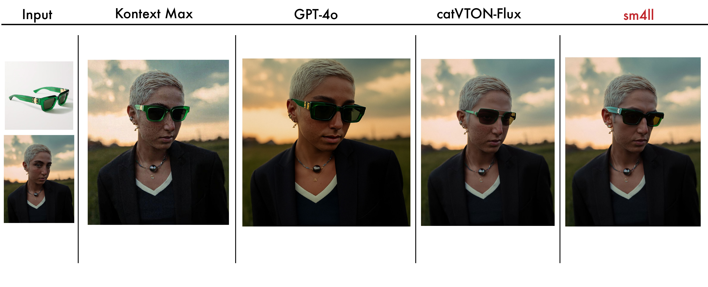
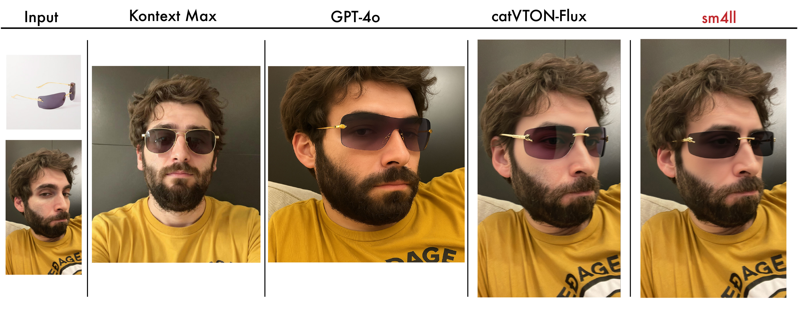
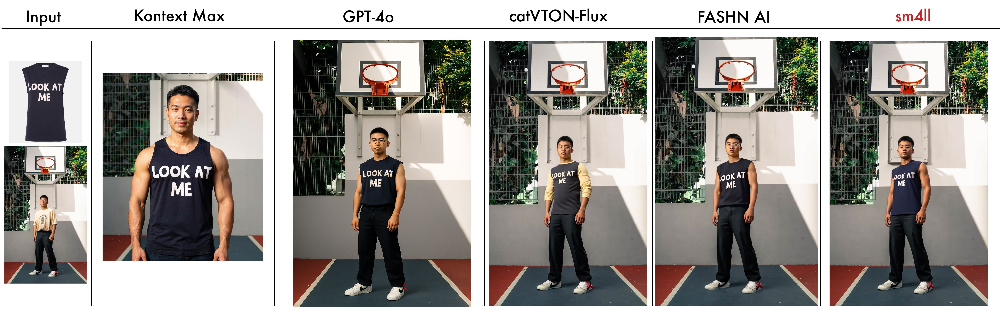
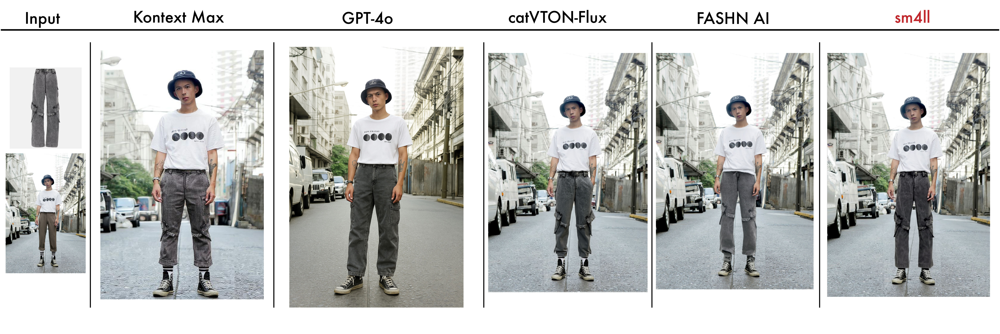
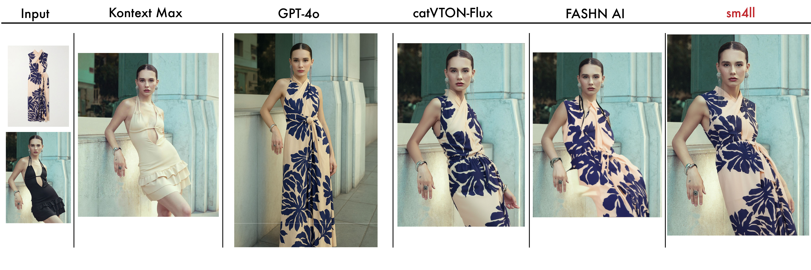
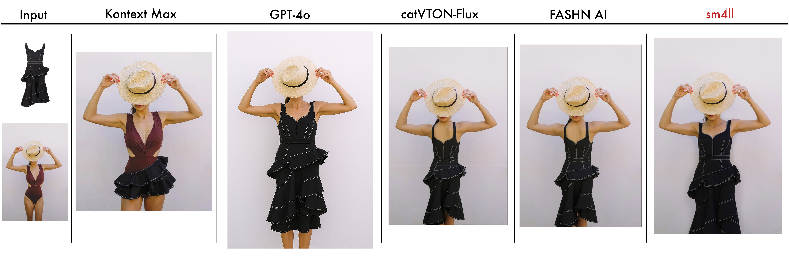

# sm4llVTONs: A Family of Specialized Virtual Try-On Models

**Authors:** [Andrea Baioni](mailto:andrea@andreabaioni.com), [Alex Puliatti](mailto:a@puliatti.com)
---

sm4llVTONs (same methodology 4 all VTON) is a new family of highly efficient and specialized diffusion models for virtual try-on (VTON) applications, and more. This page provides an overview of our current models, methodology, and performance benchmarks. 

---

### Our Current Models

The sm4llVTONs family consists of several models, each an expert in a specific VTON domain. 

| Model Name       | Task                     | Status  |
| ---------------- | ------------------------ | ------- |
| sm4ll-eye        | Sunglasses & Eyewear     | Pre-release |
| sm4ll-shoes      | Shoes & Footwear         | Pre-release |
| sm4ll-face       | Face Swapping            | Beta    |
| sm4ll-top        | Upper Body Garments      | Alpha   |
| sm4ll-bottom     | Lower Body Garments      | Alpha   |
| sm4ll-dress      | Dresses                  | Alpha   |
| sm4ll-bg         | Background Replacement   | Alpha   |

### Key Philosophy & Features

Our work is guided by a core philosophy that distinguishes it from general-purpose VTON and image editing models. Instead of a single, large model that handles many tasks, sm4llVTONs are experts fine-tuned for a single purpose. This results in higher fidelity, better detail preservation, and more intuitive control. Our methodology is built around a "train-like-you-infer" principle, ensuring that our models perform reliably on in-the-wild images, not just curated datasets.

## Results

### Glasses
| Example 1 | Example 2 | Example 3 | Example 4 |
| :---: | :---: | :---: | :---: |
|  |  |  |  |

### Top
| Example 1 | Example 2 | Example 3 | Example 4 |
| :---: | :---: | :---: | :---: |
|  |  |  |  |

### Bottom
| Example 1 | Example 2 | Example 3 | Example 4 |
| :---: | :---: | :---: | :---: |
|  |  |  |  |

### Dresses
| Example 1 | Example 2 | Example 3 | Example 4 |
| :---: | :---: | :---: | :---: |
|  |  |  |  |

### Shoes
| Example 1 | Example 2 | Example 3 | Example 4 |
| :---: | :---: | :---: | :---: |
|  |  |  |  |

### Qualitative Evaluations

- **Flux Kontext**: We struggled to find a consistent prompt structure for desired image modifications. Results shown are the best achievable but may not represent the model's full potential.
- **GPT-4o**: Produces aesthetically pleasing images but often generates a new image rather than modifying the original, which is unsuitable for production environments.
- **FASHN.ai**: Unique in its predictive approach to autosegmentation. Some poor results are likely due to limitations in the segmentation system, not the underlying model.
- **CatVTON Flux**: Performs well in generalization, even with out-of-scope items like eyewear and shoes, despite being trained on a dataset optimized for garments.
- **sm4llVTONs**: Our models consistently demonstrated stronger performance in:
      - Delivering accurate results through specialized, expert models.
      - Minimally affecting the input image while maintaining product precision, a key concern in production pipelines.

---
### Roadmap
- [x] Release HuggingFace Gradio demo
- [ ] Release Alpha models for Eyewear and Shoes (768px)
- [ ] Release Alpha models for other categories (768px)
- [ ] Release Paper
---

The sm4llVTONs family of models represents a significant step forward in specialized virtual try-on applications. By focusing on lightweight, expert models and a "train-like-you-infer" methodology, we achieve high-fidelity results that are robust to real-world conditions. Future work will involve releasing the full research paper with detailed benchmarks and continuing the development of our alpha and beta models.

---

## BibTeX

```bibtex
@inproceedings{sm4llVTONs2025,
  title={sm4llVTONs: A Family of Specialized Virtual Try-On Models},
  author={Andrea Baioni and Alex Puliatti},
  year={2025}
}
